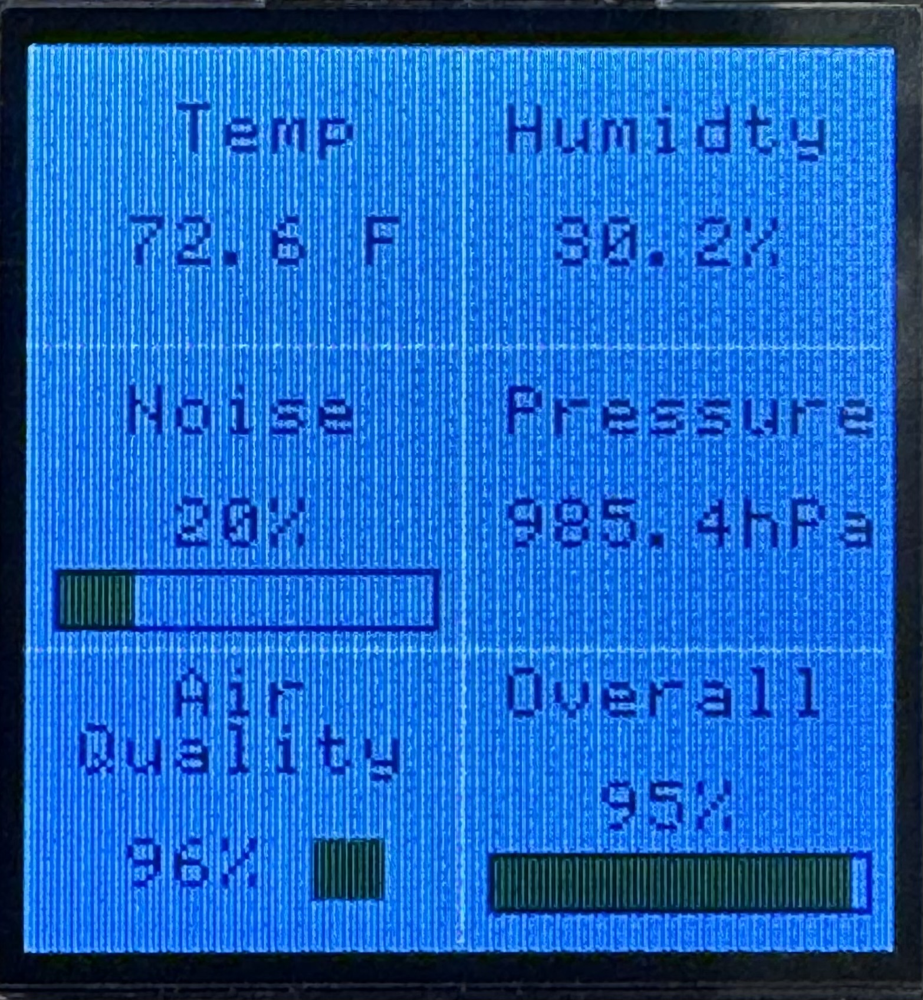

# Environment Monitor

Our Environment Monitor is a comprehensive system managed by mbed, designed to measure and display various environmental parameters. It provides real-time data on temperature, humidity, air pressure, ambient noise level, and air quality, all shown on a uLCD display.

## Team Members

John Landrum, Nikola Porto, Zekai Wang

## Components

mbed LPC1768: Main control unit

Adafruit MiCS 5524 Sensor: Gas sensor for air quality

μLCD-144-G2 Display: For data visualization

MPL115A2 Sensor: Measures barometric pressure & temperature

SPW2430 Sensor: MEMS microphone for noise level detection

Adafruit Si7021 Sensor: Measures temperature & humidity

## Features

Plug-and-play operation

Real-time environmental data monitoring

Color LCD for clear data display

Code Used: [main.cpp](Environment Monitor/main.cpp)

## Library Used

[Si7012 Temperature & Humidity Sensor](https://os.mbed.com/users/mcm/code/SI7021/)

[MPL115A2 - Barometer and temperature sensor](https://os.mbed.com/components/MPL115A2/)

[uLCD-144-G2 128 by 128 Smart Color LCD](https://os.mbed.com/users/4180_1/notebook/ulcd-144-g2-128-by-128-color-lcd/)

## Installation

For Si7012, MPL115A2, they use I2C protocal so they need to connect to SDA and SCL pins respectively. The uLCD takes serial connections but since I2C also takes serial that leaves only one set of serial pins for the uLCD.

For MiCS5524, SPW2430, they use analog outout which in turns mean their data pin needs to be connected to mbed's analogin pin.

All sensors and the uLCD used take either only 5V or it takes 3.3V too. For the sake of simplicity we chose to use 5V uniformly sourced from external power DC connection.

## Usage

The simplest way to implement this project file is to import the entirety of Environment Monitor folder to Keil Studio. Compile and transfer the file to your mbed and it would run. Specially attention to pin assignments is recommended.

## Future Improvements

Making the system more compact and portable

Adding a casing and internal battery

Integrating more sensors for diverse environmental data

Enabling internet connectivity and cloud data upload

Implementing remote monitoring and warnings for environmental changes

### Georgia Institute of Technology, ECE 4180 section B, final project, Fall 2023.
